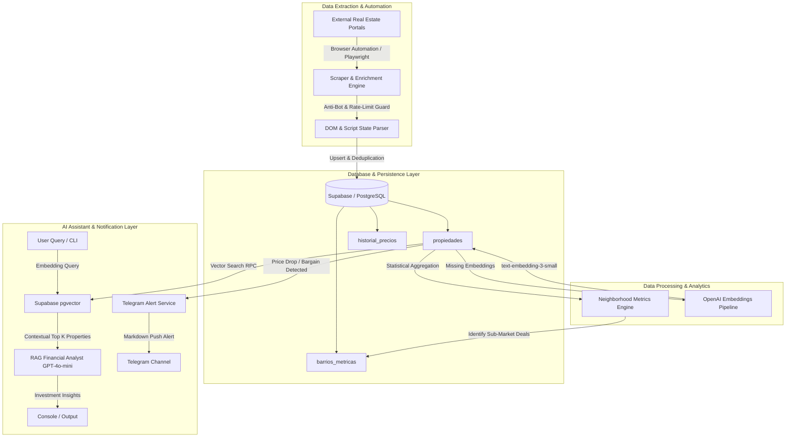

# Real Estate Analytics, Vector Search & RAG Investment Engine

An end-to-end autonomous data engineering and AI-driven investment analysis platform for real estate properties. The system continuously ingests property listings across multiple web sources, enriches property details using resilient browser automation, computes micro-location valuation metrics, generates vector embeddings for semantic search, and powers a Retrieval-Augmented Generation (RAG) assistant for real estate investment analysis and flipping opportunities.

---

## 🌟 Technical Highlights & Core Skills

- **Autonomous Multi-Source Data Ingestion & ETL**: Scalable pipeline for extracting, parsing, deduplicating, and normalizing heterogeneous property listings.
- **Resilient Web Automation & Anti-Bot Evasion**: Playwright-based scraper engine equipped with custom user-agent rotational strategies, rate-limit backoff logic, and Cloudflare WAF 1015 error detection with dynamic cool-down periods.
- **Vector Search & Database Architecture**: Integration with PostgreSQL via **Supabase** and **`pgvector`** for storing high-dimensional embeddings and performing cosine distance similarity queries via stored procedures (RPC).
- **Retrieval-Augmented Generation (RAG)**: Natural language investment assistant built with OpenAI Embeddings (`text-embedding-3-small`) and LLMs (`gpt-4o-mini`) to evaluate financial feasibility, price per square meter, and renovation potential.
- **Micro-Location Analytics & Bargain Detection Algorithm**: Automated statistical aggregation computing mean, median, min, and max price per $m^2$ across neighborhoods, triggering alerts for sub-market price opportunities.
- **Real-Time Push Notifications**: Asynchronous alerting system built with the Telegram Bot API to notify investors immediately upon detecting significant price drops or undervalued listings.

---

## 🏗️ System Architecture



---

## 🚀 Key Functionalities & Features

### 1. Resilient Ingestion & Enrichment Engine
- Multi-phase scraping pipeline designed to extract listing attributes: price, total area, rooms, bathrooms, location, administration fee, parking spots, and seller notes.
- **DOM & Script State Traversal**: Deep DOM element evaluation combined with Angular script payload extraction to recover structured attributes (estrato, administration fee, elevator availability, storage unit, gated community).
- **Inactivity Audit**: Detects inactive or removed listing pages during enrichment and updates database status (`activo: false`) automatically.

### 2. Micro-Location Market Analytics Engine
- Computes aggregate real estate metrics for each micro-location (neighborhood):
  - Mean price per $m^2$ ($\mu$)
  - Exact median price per $m^2$ ($\tilde{x}$)
  - Min and max bounds
- **Bargain Opportunity Detector**: Automatically compares individual listing price per $m^2$ against neighborhood baselines to identify properties offered at a target percentage discount.

### 3. Vector Database & Semantic Property Search
- Transforms rich property metadata (location, specs, features, detailed description) into 1536-dimensional embeddings.
- Executes similarity matching via `pgvector` stored procedure `buscar_propiedades_semantica` with similarity threshold filters.

### 4. RAG Investment Assistant
- Accepts natural language user queries (e.g., *"Find 2-bedroom apartments in northern neighborhoods ideal for flipping under 300M"*).
- Converts the query into a vector representation, queries the database for contextually relevant listings, and feeds the structured data into an LLM financial analyst prompt.
- Produces quantitative comparisons, ROI insights, price/$m^2$ justifications, and listing references.

### 5. Automated Price Audit & Telegram Alerting
- Tracks historical changes in `precio_venta` per property.
- Audits price drop percentages and records delta events in `historial_precios`.
- Generates rich Markdown alert cards sent directly to Telegram channels for rapid investor reaction.

---

## 🛠️ Technology Stack

| Domain | Technologies |
| :--- | :--- |
| **Language & Runtime** | Node.js (ES Modules), TypeScript (`tsx`) |
| **Web Automation & Scraping** | Playwright (Chromium), HTTP Client Fetch |
| **Database & Vector Store** | PostgreSQL, Supabase Client (`@supabase/supabase-js`), `pgvector` |
| **AI / Machine Learning** | OpenAI API (`text-embedding-3-small`, `gpt-4o-mini`), RAG Architecture |
| **Alerting & Messaging** | Telegram Bot API |
| **Environment & Config** | `dotenv`, Native Node ESM module resolution |

---

## 📂 Project Structure

```
.
├── src/
│   ├── index.ts                      # Main entrypoint for ingestion pipeline
│   ├── scrapers/                     # Web extraction modules & anti-bot handlers
│   │   ├── ciencuadras.ts            # Dynamic listing extractor
│   │   ├── fincaraiz.ts              # Provider listing parser
│   │   └── mercadolibre.ts           # Portal scraper logic
│   ├── scripts/                      # Autonomous data & AI processing scripts
│   │   ├── enriquecer_detalles.ts    # Deep DOM enrichment & Cloudflare 1015 rate limit guard
│   │   ├── generar_embeddings.ts     # OpenAI vector embedding generator
│   │   ├── calcular_metricas_barrios.ts # Statistical neighborhood metrics & deal finder
│   │   ├── buscar_semantica.ts       # CLI semantic vector search tool
│   │   ├── asistente_rag.ts          # Natural language RAG investment assistant
│   │   ├── limpiar_inactivos.ts      # Stale listing cleaner
│   │   └── prueba_enriquecer.ts      # Unit test script for scraper enrichment
│   ├── services/
│   │   ├── supabase.ts               # Database client, search config & upsert logic
│   │   └── telegram.ts               # Telegram notification service
│   ├── types/                        # TypeScript domain interfaces & DB models
│   └── utils/                        # Formatting & text normalization utilities
├── package.json
├── tsconfig.json
└── README.md
```

---

## 📋 Prerequisites & Setup

### Prerequisites
- **Node.js**: v18.x or higher
- **Supabase Account**: With PostgreSQL and `pgvector` extension enabled
- **OpenAI API Key**: For embedding generation and RAG processing
- **Telegram Bot** *(Optional)*: Bot token and Chat ID for push notifications

### Environment Variables (`.env`)
Create a `.env` file in the root directory:

```env
SUPABASE_URL=https://your-project.supabase.co
SUPABASE_KEY=your-supabase-anon-or-service-role-key
OPENAI_API_KEY=sk-proj-your-openai-api-key
TELEGRAM_BOT_TOKEN=your-telegram-bot-token
TELEGRAM_CHAT_ID=your-telegram-chat-id
```

---

## 🏃 Pipeline Execution Commands

| Command | Action |
| :--- | :--- |
| `npm run start` | Executes the main ingestion pipeline to fetch active listings and sync to Supabase. |
| `npm run dev` | Runs main ingestion in watch mode using `tsx`. |
| `npm run enriquecer` | Runs batch browser enrichment (DOM traversal, state extraction, Cloudflare rate-limit mitigation). |
| `npm run embeddings` | Generates vector embeddings for all active properties lacking vector representations. |
| `npm run metricas` | Calculates neighborhood market averages/medians and outputs the top sub-market bargains. |
| `npm run buscar` | Performs a test vector search using a text prompt. |
| `npm run preguntar` | Executes the RAG Investment Assistant to generate financial analysis for a query. |
| `npm run limpiar` | Deactivates listings marked as sold or unavailable. |

---

## 💡 Engineering Design Principles Demonstrated

1. **Defensive Web Automation**: Implements human-like jittered timeouts, user-agent spoofing, headful context isolation, and automatic cool-down pause handling when WAF rate limits (HTTP 429 / Cloudflare 1015) occur.
2. **Idempotent Data Ingestion**: Uses composite key upsert strategy (`portal_origen`, `id_anuncio_externo`) to prevent duplication and record historical price variations cleanly.
3. **Decoupled System Architecture**: Separates data extraction, enrichment, analytics, embedding creation, and notification into modular pipelines that can run independently or on scheduled cron jobs.
4. **Vector Retrieval & RAG**: Combines structured SQL filters with unstructured semantic vector similarity to deliver precise, context-aware AI recommendations.
